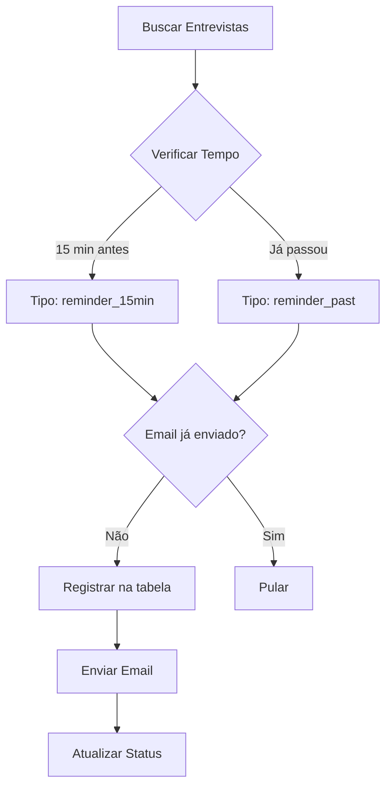

# Sistema de Lembretes de Entrevista - Documentação Completa

## 📋 Visão Geral

Sistema profissional e robusto para envio automático de lembretes de entrevista, com controle de duplicação e rastreabilidade completa através da tabela `hr_interview_email_logs`.

## 🎯 Funcionalidades Principais

### 1. **Envio de Lembretes 15 Minutos Antes**
- ✅ Detecta entrevistas que acontecerão em 15 minutos
- ✅ Envia email para RH e opcionalmente para candidato
- ✅ Verifica se email já foi enviado antes de reenviar

### 2. **Envio de Lembretes para Entrevistas Passadas**
- ✅ Detecta entrevistas que já passaram (até 24h atrás)
- ✅ Envia email de aviso se ainda não foi enviado
- ✅ Útil para casos onde o sistema estava offline

### 3. **Controle de Duplicação**
- ✅ Verifica na tabela `hr_interview_email_logs` antes de enviar
- ✅ Registra todos os envios com status (`sent`, `failed`, `pending`)
- ✅ Previne envio duplicado mesmo após reinicialização

## 🏗️ Arquitetura do Sistema

### Tabelas do Banco de Dados

#### `hr_interview_email_logs`
```sql
- id: Identificador único
- email_type: ENUM('daily_alert', 'reminder_15min', 'reminder_past', 'reminder_candidate')
- application_id: ID da candidatura
- interview_date: Data/hora da entrevista
- status: ENUM('pending', 'sent', 'failed', 'skipped')
- sent_at: Timestamp de envio
- retry_count: Contador de tentativas
```

#### `hr_interview_email_config`
```sql
- config_key: Chave de configuração
- config_value: Valor
- is_active: Status ativo/inativo
```

### Fluxo de Processamento



## 🔧 Componentes Principais

### 1. `getUpcomingInterviews()` - Controller
**Arquivo**: `server/controllers/hr-job-openings.js`

```javascript
// Busca entrevistas elegíveis para lembrete
// - Futuras: próximos 15 minutos
// - Passadas: até 24 horas atrás
// - Exclui as que já tiveram email enviado
```

**Características**:
- ✅ Query SQL otimizada com `NOT EXISTS`
- ✅ Verifica `hr_interview_email_logs` diretamente no SQL
- ✅ Usa horário local do servidor (Brasil UTC-3)
- ✅ Filtro JavaScript adicional para validação

### 2. `InterviewEmailManager` - Service
**Arquivo**: `server/services/interview-email-manager.js`

```javascript
// Gerencia o ciclo de vida dos emails
class InterviewEmailManager {
  registerEmail()     // Registra email para envio
  processPendingEmails() // Processa fila de emails
  registerReminders()  // Registra lembretes específicos
}
```

**Características**:
- ✅ Verifica duplicatas antes de registrar
- ✅ Sistema de retry para falhas
- ✅ Logs detalhados de cada operação

### 3. Cron Jobs
**Arquivo**: `server/scripts/interview-alert-cron.js`

```javascript
// A cada 5 minutos: Verifica lembretes
'*/5 * * * *' → checkReminders()

// A cada 5 minutos: Processa emails pendentes
'*/5 * * * *' → processPendingEmails()
```

## 📊 Queries SQL Importantes

### Buscar Entrevistas sem Email Enviado
```sql
SELECT * FROM hr_job_applications ja
WHERE ja.interview_date IS NOT NULL
AND NOT EXISTS (
  SELECT 1 FROM hr_interview_email_logs el
  WHERE el.application_id = ja.id 
  AND el.email_type IN ('reminder_15min', 'reminder_past')
  AND el.status = 'sent'
)
```

### Verificar Histórico de Emails
```sql
SELECT 
  email_type,
  status,
  sent_at,
  error_message
FROM hr_interview_email_logs
WHERE application_id = ?
ORDER BY created_at DESC
```

## 🧪 Como Testar

### 1. Teste Completo do Sistema
```bash
node server/scripts/test-interview-reminder-system.js
```

### 2. Criar Entrevista de Teste
```bash
# Criar entrevista 12 minutos no futuro
node server/scripts/create-test-interview.js

# Criar entrevista passada
node server/scripts/test-past-interview-reminder.js create
```

### 3. Processar Lembretes Manualmente
```bash
node server/scripts/process-interview-emails.js reminders
```

### 4. Verificar Logs no Banco
```sql
-- Ver todos os emails enviados hoje
SELECT * FROM hr_interview_email_logs 
WHERE DATE(created_at) = CURDATE()
ORDER BY created_at DESC;

-- Ver emails pendentes
SELECT * FROM hr_interview_email_logs 
WHERE status = 'pending';

-- Ver histórico de uma candidatura
SELECT * FROM hr_interview_email_logs 
WHERE application_id = ?;
```

## ⚙️ Configurações

### Habilitar/Desabilitar Lembretes
```sql
-- Desabilitar lembretes de 15 min
UPDATE hr_interview_email_config 
SET config_value = 'false' 
WHERE config_key = 'reminder_15min_enabled';

-- Habilitar lembretes para candidatos
UPDATE hr_interview_email_config 
SET config_value = 'true' 
WHERE config_key = 'candidate_reminder_enabled';
```

### Configurar Destinatários
```sql
UPDATE hr_interview_email_config 
SET config_value = '["rh@empresa.com", "gestor@empresa.com"]'
WHERE config_key = 'recipient_emails';
```

## 🐛 Solução de Problemas

### Email não está sendo enviado

1. **Verificar se a entrevista está no período correto**:
```sql
SELECT 
  interview_date,
  TIMESTAMPDIFF(MINUTE, NOW(), interview_date) as minutes_until
FROM hr_job_applications
WHERE id = ?;
```

2. **Verificar se já foi enviado**:
```sql
SELECT * FROM hr_interview_email_logs
WHERE application_id = ?
AND email_type IN ('reminder_15min', 'reminder_past')
AND status = 'sent';
```

3. **Verificar configurações**:
```sql
SELECT * FROM hr_interview_email_config
WHERE config_key LIKE '%reminder%';
```

### Cálculo de minutos incorreto

O sistema usa horário local (Brasil UTC-3):
- `NOW()` no MySQL retorna horário local
- JavaScript usa `Date()` com timezone America/Sao_Paulo
- Não fazer conversões desnecessárias de timezone

## 📈 Métricas e Monitoramento

### Dashboard de Status
```sql
SELECT 
  COUNT(CASE WHEN status = 'sent' THEN 1 END) as enviados,
  COUNT(CASE WHEN status = 'pending' THEN 1 END) as pendentes,
  COUNT(CASE WHEN status = 'failed' THEN 1 END) as falhados,
  COUNT(*) as total
FROM hr_interview_email_logs
WHERE DATE(created_at) = CURDATE();
```

### Taxa de Sucesso
```sql
SELECT 
  email_type,
  COUNT(*) as total,
  COUNT(CASE WHEN status = 'sent' THEN 1 END) as sucesso,
  ROUND(COUNT(CASE WHEN status = 'sent' THEN 1 END) * 100.0 / COUNT(*), 2) as taxa_sucesso
FROM hr_interview_email_logs
GROUP BY email_type;
```

## ✅ Checklist de Implementação

- [x] Query SQL verifica emails já enviados
- [x] Sistema registra todos os envios na tabela
- [x] Verificação de duplicatas antes de enviar
- [x] Suporte para entrevistas passadas
- [x] Logs detalhados para debug
- [x] Scripts de teste completos
- [x] Documentação atualizada
- [x] Cron jobs configurados
- [x] Sistema de retry para falhas
- [x] Configurações dinâmicas no banco

## 🚀 Melhorias Futuras

1. **Dashboard Web** para visualizar status dos emails
2. **Notificações SMS** como backup
3. **Templates personalizados** por departamento
4. **Relatórios automáticos** de taxa de entrega
5. **Integração com calendário** (Google Calendar, Outlook)

---

**Última atualização**: Dezembro 2024
**Versão**: 2.0
**Autor**: Sistema SIRIUS 